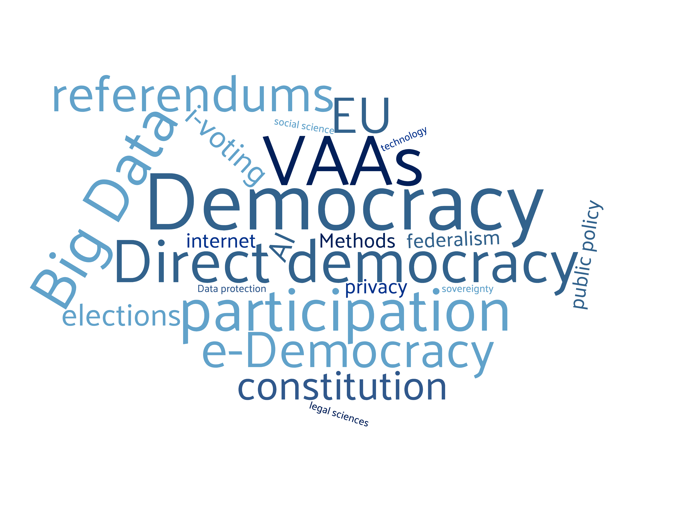

# **Welcome**

I am a researcher based at the Univesity of Zürich. A political scientist by training, my work is mostly interdisciplinary blending various sub-fields of Political Science (e.g., comparative politics, political behaviour and political communication) while also drawing on other fields such as Comparative Law and Computer Science. 

#### Some of my ongoing research activities:
*   *Comparative politics* (especially cross-national comparative work on institutions of direct democracy)  
*   *Political behaviour* (especially political attitudes and voting behaviour)
*   *Political communication* (especially around the analysis of Big Data using topic modeling and sentiment analysis techniques)  
<<<<<<< HEAD
*   *Digital Politics and Policy * (especially internet voting and e-participation)  
=======
*   *Digital Politics and Policy * (esp. internet voting and e-participation)  
>>>>>>> a7b0a6c88534d26235b7a7354b86408d06c552b0
*   *Machine learning* (mainly supervised learning approaches to voting behaviour and data mining of public opinion data)
*   *Constitional design* (especially on institutional procedures for incorporating instruments of democratic participation.)

#### Contact
fmendez72[at]gmail.com

    

